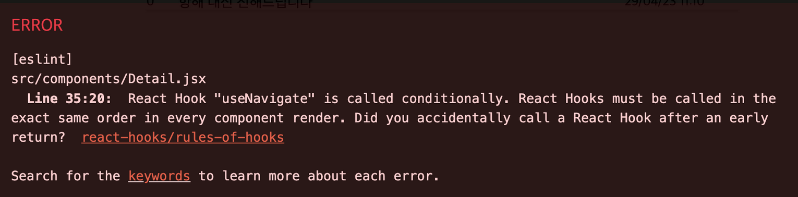

# 항해 대나무숲


## 항해99 주특기언어 과제 Lv.4
개발기간 : 2일

<br/>
<br/>

***

## 프로젝트 소개
주특기언어로 강의를 듣고 CRUD구현
주제는 자유여서 항해에 관련된 주제로 정하면 좋을 것 같아서 결정.

항해에 대해 불만이라던가 좋은점을 익명으로 작성해서 부담없이 소통할 수 있다.

<br/>
<br/>

***


## 사용한 라이브러리
styled components

react - router - dom

json-server

axios

react-query

<br/>
<br/>

***
## 화면구성


<br/>
<br/>


***
## 주요기능
게시글 입력 기능

게시글 상세페이지

게시글 수정, 삭제

<br/>
<br/>

***
## 트러블 슈팅

<br/>

### props 조건문

1. 오류가 발생한 경로
  
    header컴포넌트를 이용해서 상단에 header가 어떤 컴포넌트에도 보이도록  공통적으로 줬는데 그렇게 하다보니 header에 이전으로 가기 버튼을 만들어서 경로에 -1을 해주니까 잘 되돌아가기는 하나 최초시작이였던 Home컴포넌트에서 뒤로가기버튼도 적용이 되다보니 눌렀을때 이상한 경로로 가졌다.

2. 오류를 해결하기 위해 시도해본 것들

    Home컴포넌트에서 props로 true를 보내줘서 이전으로 가기버튼에 조건문으로 true가 아닐때만 버튼이 활성화되도록 한다.

    <br/>

    *해결중 문제점*

    > jsx문법에서는 if문 자체를 사용할 수 없다. 

3. 오류 해결 방법

    Visivle을 props로 내려주는데 값을 true로 내려줘서 Home에만 true가 되어있다. 그렇게 때문에 Visibls가 true가 아닌것만 button이 보여지게 했다.
    ```jsx
    {!Visible && <Button>이전으로</Button>}
    ```
  <br/>

### 삭제버튼

1. 오류가 발생한 경로
  
    삭제하기 버튼을 눌렀을때 db에서 정상적으로 삭제는 되지만 이전 페이지로 안가져서 뒤로가기를 눌러야만 이전페이지로 가졌다.

2. 오류를 해결하기 위해 시도해본 것들

    삭제하기 버튼 onClick 이벤트를 이용해서 confirm으로 삭제를 정말 할건지 확인 후 완료를 누르면 useNavigate를 사용해서 “/main”페이지로 이동되도록하려고함. 

    ```jsx
    const CONFIRM_MESSAGE = `[삭제 확인]\n\n게시물을 정말로 삭제하시겠습니까?\n삭제를 원치 않으시면 [취소] 버튼을 눌러주세요.`;
    const navigate = useNavigate();
    const onClickRemoveButtonHandler = (id) =>{
      if(window.confirm(CONFIRM_MESSAGE)){
        mutation.mutate(id)
        navigate("/main")
      }
    }
    ```

    <br/>
    
  
    <br/>

    실패이유 useNavigate() 훅은 조건부로 호출될 수 없다 이다.
    
    ```jsx
    const navigate = useNavigate();
    ```

    <br/>

    ```
    const navigate = useNavigate();
    const mutation =useMutation(removeBoards,{
      onSuccess: ()=>{
        QueryClient.invalidateQueries("posts")
        navigate("/main")
      }
    })
    ```

    이렇게 위로 다 올려줬는데 이렇게 또 에러가 뜬다. 

3. 오류 해결 방법

    ```
    navigate("/main")
    ```
    이것만 다시 온클릭 함수로 넣어줬더니 정상적으로 페이지 이동이 된다.
    개인적인 추측으로는 useNavigate를 mutation보다 밑에서 선언해서 그런게 아닌가 싶다 .

<br/>

1. 오류가 발생한 경로

    수정하기 하는데 수정할때 원래 있던 값이 그대로 input에 불러오려고 했는데 동적라우팅으로 들어온 페이지에서 foundDate에서 title값을 초기값으로 쓰려고했는데 useState는 맨위에 선언되어야 하기때문에 에러가 난다. 


2. 오류 해결 방법

    일단 useState의 초기값을 빈값으로 선언하고 수정하기 버튼이 눌렸을때 setState로 상태값을 foundDate.title값으로 바꿔줘서 input창이 생길때 이전 값이 보여지게 했다.


